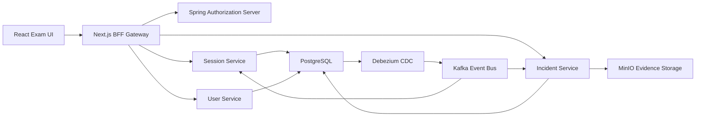

<div align="center">

# Nguyen Hong Hoang

### Backend Developer | Distributed Systems | Realtime Monitoring | AI-assisted Proctoring

<p>
  <a href="https://github.com/NguyenHonggHoang">
    
  </a>
  <a href="https://github.com/NguyenHonggHoang?tab=followers">
    
  </a>
  <a href="https://github.com/NguyenHonggHoang?tab=repositories">
    
  </a>
</p>

<p>
  I build backend-heavy systems with a focus on authentication, event-driven architecture,
  realtime workflows, and practical AI-assisted monitoring products.
</p>

</div>

---

## About Me

- Final-year Software Engineering student.
- Backend-focused developer interested in distributed systems, authentication, realtime architectures, and high-performance APIs.
- Currently building systems around online exam proctoring, OAuth2/OIDC authorization, Kafka-based event pipelines, and realtime monitoring.
- Comfortable working across backend, frontend, infrastructure, and AI/CV integrations when the product requires end-to-end ownership.

## Main Focus

```text
Backend Engineering      Spring Boot, Security, API design, microservices
Realtime Systems         WebSocket, STOMP, event streaming, monitoring flows
Messaging & CDC          Kafka, RabbitMQ, Debezium, async processing
Data & Infrastructure    PostgreSQL, Redis, Docker, MinIO, observability
AI-assisted Monitoring   Face/gaze tracking, suspicious-event detection, scoring
```

## Tech Stack

### Backend

<p>
  
</p>

- Java 17, Spring Boot, Spring Security, Spring Authorization Server
- REST API, OAuth2/OIDC, JWT, role-based access control
- JPA/Hibernate, PostgreSQL, Redis, Flyway
- Kafka, RabbitMQ, WebSocket/STOMP, Debezium CDC
- Swagger/OpenAPI, Docker, Docker Compose

### Frontend

<p>
  
</p>

- React, Next.js, TypeScript, TailwindCSS, Material UI
- Backend-for-Frontend patterns, authenticated client flows, realtime UI updates

### AI, Computer Vision & Automation

<p>
  
</p>

- Python, Flask microservices, TensorFlow.js, OpenCV
- Face detection, gaze/iris tracking, sentiment/news analysis, prediction services

### Tools & Infrastructure

<p>
  
</p>

- Git, GitHub Actions, Linux/WSL2
- Prometheus, Grafana, MinIO
- Local development and deployment with Docker-based environments

## Featured Projects

### Online Exam Cheating Detection System

> A microservices-based online proctoring platform for realtime suspicious-behavior detection during exams.

Repository: [NguyenHonggHoang/Exam-Cheating-Detection-Online](https://github.com/NguyenHonggHoang/Exam-Cheating-Detection-Online)

**Highlights**

- React exam UI, Next.js BFF gateway, and Spring-based backend services.
- OAuth2 Authorization Server for identity and secure access flows.
- Session, incident, user, admin, and gateway services separated by responsibility.
- PostgreSQL multi-database setup with Redis, Kafka, Debezium CDC, MinIO, and RabbitMQ.
- Realtime incident tracking, evidence handling, browser-event monitoring, and proctoring workflows.



### AuthModule

Repository: [NguyenHonggHoang/AuthModule](https://github.com/NguyenHonggHoang/AuthModule)

A Spring Boot authentication and authorization module for a Carbon Credit Marketplace, including JWT access/refresh tokens, email verification, password reset, audit logging, Redis caching, PostgreSQL, Docker, and Swagger/OpenAPI documentation.

### Convertion-App

Repository: [NguyenHonggHoang/Convertion-App](https://github.com/NguyenHonggHoang/Convertion-App)

A full-stack conversion platform with Spring Boot, React, and Flask microservices for unit conversion, currency conversion, user management, economic news analysis, sentiment processing, and exchange-rate alerts.

### RabbitMQ Practice Project

Repository: [NguyenHonggHoang/RabbitMQ](https://github.com/NguyenHonggHoang/RabbitMQ)

A Spring Boot example project for asynchronous message processing with RabbitMQ, demonstrating queue-based product updates and non-blocking backend flows.

### AI Tools Research Collection

Repository: [NguyenHonggHoang/system-prompts-and-models-of-ai-tools](https://github.com/NguyenHonggHoang/system-prompts-and-models-of-ai-tools)

A curated collection related to system prompts and AI tool/model behavior, useful for understanding how modern AI coding and assistant tools are structured.

## What I Care About

- Designing backend services with clear boundaries and predictable contracts.
- Building secure authentication and authorization flows instead of treating auth as an afterthought.
- Using asynchronous messaging where it simplifies reliability, integration, and observability.
- Creating systems that are practical to run locally with Docker and realistic infrastructure dependencies.
- Turning AI/CV ideas into product workflows with scoring, monitoring, storage, and review paths.

## GitHub Stats

<div align="center">


<br />


</div>

## Connect

<p>
  <a href="https://github.com/NguyenHonggHoang">
    
  </a>
</p>

---

<div align="center">

Focused on building backend systems that are secure, observable, event-driven, and useful in real products.

</div>
